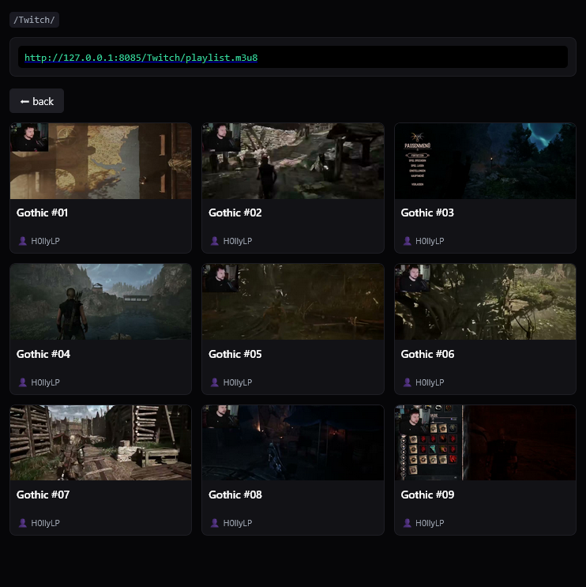

# govodstr 🎬💤

A minimalist, high-performance, single-binary Video-on-Demand (VOD) streaming server written in Go. It is specifically engineered to host large, downloaded streams from twitch on resource-constrained hardware like the ZimaBlade (ZimaOS) or lightweight NAS, delivering them smoothly to mobile media players.

## 📸 Preview

<p align="center">
  
</p>

## 📖 User Story

> As a user who loves watching long video streams in bed on my smartphone, I want a lightweight local streaming server that indexes my media directories instantly, so that I can browse my files via a mobile-optimized, buttonless dark UI and stream them without draining my phone's battery or congesting the local Wi-Fi bandwidth overnight.

---

## 🚀 Key Features & Architecture

- **Single-File Streaming:** Unlike traditional HLS servers, `govodstr` leaves your filesystem clean. It does **not** slice your large videos into hundreds of thousands of tiny `.ts` chunks. It serves the original `.mp4` file directly.
- **HTTP 206 Partial Content:** Fully supports standard byte-range requests. This allows players like `mpvExtended` to parse embedded MP4 `moov-atoms` instantly, enabling seamless hour-by-hour chapter skipping. (requires proper [Video Optimization](#️-video-optimization-for-instant-playback)).
- **Smart Directory Caching (`.data.json`):** Resolves the common bottleneck where consecutive `ffprobe` calls on huge video collections cause severe page-load delays. On the first directory scan, metadata (title/artist) is fetched once and cached into a hidden local `.data.json` file.
- **Bedtime Bandwidth Throttling:** Implements an intelligent **Token-Bucket Rate Limiter with an Initial Burst**. The player gets an unthreshed **50 MB burst** upon starting or seeking a video to load the container header and render the video instantly. After the burst, the data throughput is throttled to a clean, adjustable rate (e.g., `800 KB/s`), keeping your smartphone processor cool and your local Wi-Fi free of traffic spikes.
- **On-Demand Thumbnails:** Strips background heavy lifting. Thumbnail frames are extracted via single-threaded `ffmpeg` sub-processes *only* when requested, then cached locally. Parallel requests are sequentially queued via a `sync.Mutex` lock to prevent NAS disk thrashing.
- **RESTful Path Routing:** Clean URLs without ugly query parameters (`/stream/Folder/Video.mp4` and `/Folder/playlist.m3u8`), making it fully compatible with custom playlist streaming.

---

## 🛠️ Configuration (Environment Variables)

Configure the binary inside your container using these variables:

| Variable | Default | Description |
| :--- | :--- | :--- |
| `VIDEO_DIR` | `./vod` | Path to your local Freigabe / media folder containing `.mp4` files. |
| `PORT` | `8080` | The internal port the Go server binds to. |
| `RATE_LIMIT_KB` | `800` | Network throttling threshold per stream after the 50MB initial burst (in KB/s). |

---

## 🐋 Deployment via Docker Compose - Installation

Since the build is completely automated using GitHub Actions and pushed directly to the GitHub Container Registry (`ghcr.io`), you can spin up the app on your host machine by using **Custom App (YAML mode)** with the following stack:

```yaml
version: '3.8'

services:
  mini-streamer:
    image: ghcr.io/ll3u/govodstr:latest
    container_name: govodstr
    pull_policy: always
    ports:
      - "8085:8080"
    environment:
      - VIDEO_DIR=/vod
      - PORT=8080
      - RATE_LIMIT_KB=800
    volumes:
      - /DATA/Media:/vod:ro
      - /DATA/AppData/govodstr/cache:/app/thumbnail_cache
    restart: unless-stopped
```

---

## 📱 Recommended Client App

To get the most out of your BVE (bedtime viewing experience), i recommend using **mpvExtended** for Android. It is a modern, Material3-based advanced media player built on top of `libmpv`.

👉 **Download Client:** [mpvExtended Project Website](https://mpvex.vercel.app/)

### 💤 Why it's perfect for Bedtime Viewing
What makes **mpvExtended** unique for this specific use case is its native **Sleep Timer (Sleep Mode)** functionality:
- You can set a countdown before falling asleep. Once the timer expires, the app automatically **stops the video playback** and triggers the Android system to **turn off the screen**.
- Because `govodstr` streams files via real-time HTTP byte-ranges, **the moment mpvExtended stops the video, the Go server instantly terminates the network connection and stops reading from your NAS.**
- This prevents your phone from streaming data invisibly for hours after you've fallen asleep, maximizing both **battery savings** on your phone and **deep-sleep power savings** on your hardware.

---

## 🎞️ Video Optimization for Instant Playback

To ensure your videos start in **under 2 seconds** and allow instant chapter skipping, the MP4 container's index (the `moov` atom) **must** be placed at the very beginning of the file. 

If you download streams or record videos, the index is often placed at the end of the file by default. This forces the server to read the entire file before playback can even begin.

### How to optimize your MP4 files with FFmpeg

You can re-index your existing videos without re-encoding them (which takes only a few seconds and preserves 100% of the video quality) by running this command on your PC or server:

```bash
ffmpeg -i input_video.mp4 -c copy -movflags faststart output_optimized.mp4
```

**What this command does:**
- `-i input_video.mp4`: Defines your source video file.
- `-c copy`: Streams and copies the video and audio tracks directly without heavy CPU re-encoding.
- `-movflags faststart`: Moves the structural metadata index directly to the beginning of the file, allowing `govodstr` to burst-load it instantly to your smartphone.

---

## 📄 License

This project is open-source and released under the **MIT License**. Feel free to use, modify, and distribute it for your own homelab setups.

---

## 🤖 AI Co-Authored Project

This project was developed in collaboration with an AI assistant. From the architectural design down to the optimized Go standard-library streaming pipes, the codebase and documentation were developed together by a human with the help of an AI assistant.